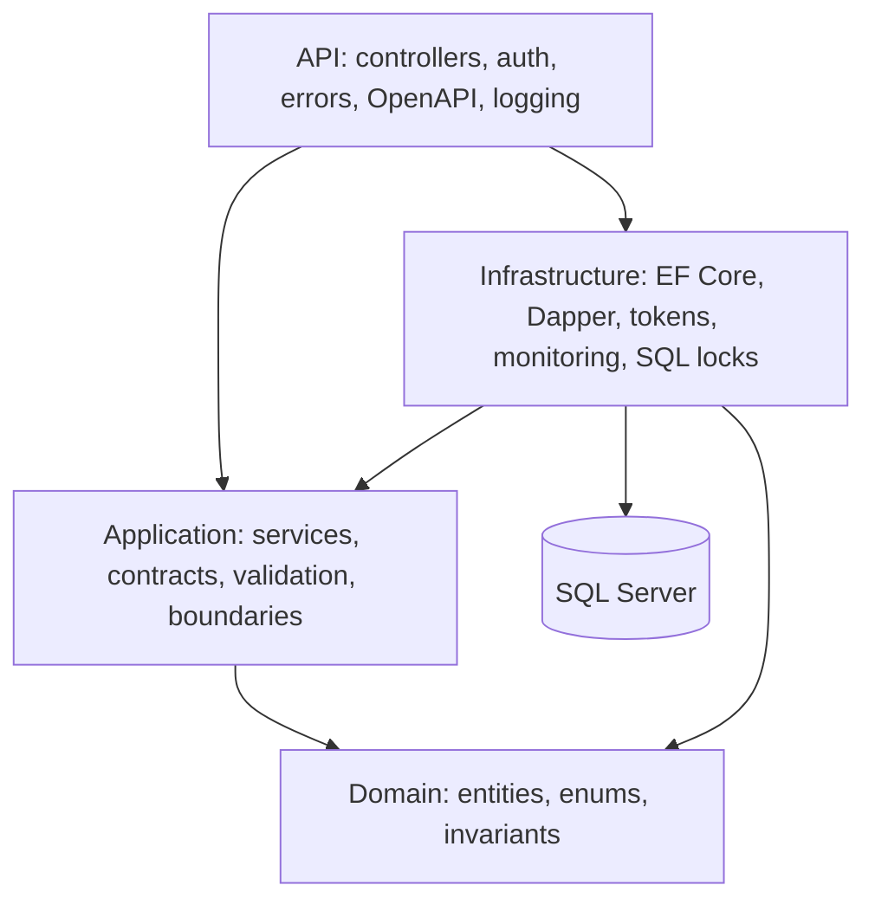
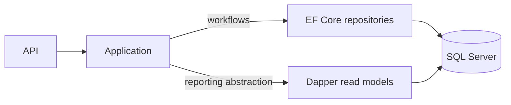
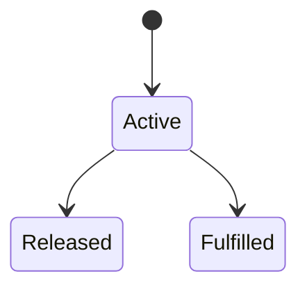
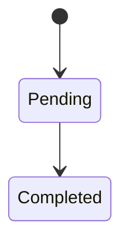

# Architecture

InventoryWarehouseApi uses layered, dependency-oriented separation. Domain code is independent of storage and HTTP concerns; the API composes application abstractions with infrastructure implementations.

## Responsibilities

- **Domain:** entities, lifecycle enums, and business invariants; no infrastructure dependency.
- **Application:** workflow services, contracts, validators, repository boundaries, and current-user/token abstractions.
- **Infrastructure:** EF Core repositories/migrations, Dapper reports, SQL Server connections, security and low-stock persistence, and provider-specific mutation locking.
- **API:** controllers, authentication/authorization, Problem Details, OpenAPI/Scalar, Serilog request logging, Development Admin bootstrap, and low-stock worker.

## Transactional and reporting paths

EF Core owns transactional workflow persistence, change tracking, migrations, and atomic operations. Dapper supplies explicit, parameterized SQL for aggregation, filtering, whitelisted sorting, and paging. It does not replace the transactional model; this split is smaller than full CQRS.

## Inventory consistency

`AvailableQuantity = OnHandQuantity - ReservedQuantity`

- **OnHandQuantity:** physical stock at one product/warehouse/location.
- **ReservedQuantity:** allocated stock not yet issued.
- **AvailableQuantity:** usable stock; derived and never persisted.

The invariants are `OnHandQuantity >= 0`, `ReservedQuantity >= 0`, and `ReservedQuantity <= OnHandQuantity`. Stock Out consumes availability. Reservation creation increases reserved quantity; release reduces it without movement; fulfillment reduces both quantities and creates one StockOut. Adjustment decreases preserve reserved stock. Transfer creation does not reserve, while completion revalidates each source position.

## Transactions and concurrency

Critical mutations use explicit Serializable transactions. SQL Server inventory and transfer mutation reads use `WITH (UPDLOCK, HOLDLOCK)`. In the tested inventory pattern this takes writer intent early, preventing shared-to-write conversion deadlocks; a competitor waits, reads committed state, and receives a 409 when the business invariant no longer permits the request.

Transfer completion locks the transfer before status evaluation and balance keys in deterministic order. There is no global retry framework, arbitrary SQL deadlocks are not blindly treated as conflicts, and the design does not claim universal deadlock elimination or distributed safety. SQLite covers relational regression behavior; real SQL Server acceptance separately exercised competing Stock Out, reservations, same-transfer completion, refresh rotation, and last-active-Admin mutation.

## Business lifecycles

Reservations have no partial release, partial fulfillment, or second terminal transition.

Pending transfers do not reserve stock. Completion revalidates availability, writes paired TransferOut/TransferIn movements, conserves stock, and commits all items atomically.

## Key design decisions

- Location balances are authoritative; warehouse totals are aggregates.
- Derived availability cannot drift from physical and allocated quantities.
- The immutable ledger makes every physical change explainable.
- Reservations separate allocation from physical movement.
- Pending transfers intentionally do not allocate stock.
- EF Core serves workflows; Dapper serves read-heavy reports.
- Serializable SQL Server writer locking protects known contention paths.
- Refresh tokens rotate and only hashes are stored.
- Background monitoring persists alerts; the low-stock report stays read-only.
